# Tech Design [Kohaku - PrivacyPools]

## **Disclaimer**

This document specifies the implementation of Privacy Pools v1 in Kohaku, an experimental wallet designed for testnet use only. Kohaku is implemented as a fork of the Ambire browser extension wallet and serves as a reference implementation for demonstrating privacy-preserving transactions.

The implementation follows a modular architecture where all privacy logic components are developed as independent modules during the extension development phase. This modular approach ensures seamless migration to the Kohaku SDK, enabling future developers to integrate Privacy Pools into their own wallets with minimal friction. The primary goal is to establish patterns and primitives that enhance the developer experience for privacy integration across the wallet ecosystem.

> **Important**: This wallet is experimental and should only be used on testnet. Production use is not recommended until the SDK reaches stable release.
> 

---

# **Background**

Ethereum's privacy infrastructure has matured significantly, with protocols like Privacy Pools v1 proven in production. Yet users still face a fragmented experience having to download specialized privacy wallets, manage additional seed phrases, and navigate complex interfaces just to make private transfers. This complexity and extra steps have become the primary barrier to privacy adoption.

The solution is clear: integrate privacy directly into existing wallets. By embedding Privacy Pools v1 into standard wallet flows, wallets can make private transactions as simple as regular transfers. Users keep their familiar wallet interface while gaining access to privacy features. No extra apps, no new mnemonics, just privacy in one click.

---

# **General**

This document specifies the integration of Privacy Pools v1 into a standard Ethereum wallet, transforming it into a privacy-preserving wallet where private transfers are just one click away. The integration follows a principle of seamless user experience: users interact with familiar wallet patterns while the complexity of zero-knowledge proofs, note management, and privacy optimization happens transparently in the background.

The wallet maintains two conceptual account types:

- **Public accounts**: Standard Ethereum addresses with public balances
- **Private account**: An aggregated view of privacy-preserving balances across supported protocols

<aside>
🔬

Privacy Pools v1 does not support incremental deposits, resulting in fragmented balances across multiple notes. The wallet abstracts this complexity by presenting a unified balance to users while handling batch operations transparently.

</aside>

### Requirements

1. The user should have a private account automatically derived from their master seed. Private keys must never leave the wallet’s secure enclave.
2. The user should be able to import an existing Privacy Pools mnemonic.
3. The user should be able to recover their private notes in a deterministic way without needing to securely store the data. 
4. The user should be able to deposit ETH from their public balance to their private balance.
5. The user should be able to withdraw assets with the wallet automatically selecting the optimal combination of notes to maximize privacy.
6. The user should be able to make withdrawals that combine several notes into an atomic batch transaction, since Privacy Pools v1 does not support incremental deposits.
7. The user should be able to send private transactions through a third party relayer, which broadcasts the transaction using a zero knowledge proof to keep the sender’s identity hidden.
8. The user should experience private transfers as simply as regular transfers.

---

# **In-Depth**

## **User Stories**

| ID | Title | Description | Priority |
| --- | --- | --- | --- |
| US-001 | Import Existing Mnemonic | Import existing Privacy Pools mnemonic | High |
| US-002 | Privacy Account from Wallet Seed | Generate privacy keys through deterministic derivation | High |
| US-003 | Deposit Public Funds | Move funds from public to private balance | High |
| US-004 | View Private Balance | Display aggregated private balance across notes | High |
| US-005 | Private Withdrawal with Relayer | Send private funds using third-party relayer | High |
| US-006 | Note Aggregation UI | View unified balance while protocol manages fragmented notes | High |
| US-007 | ASP Status Monitoring | View deposit approval status | Medium |
| US-008 | Privacy Metrics | View privacy score | Medium |
| US-009 | Self-Relay Option | Relay own withdrawals (with gas payment considerations) | Low |
| US-010 | Manual Note Selection | Override automatic note selection algorithm | Low |

[Detailed User Stories](/privacy-pools/user-stories)

**Figma UI Flows:** https://www.figma.com/design/3KKnxqwyclua6k4DPS5EGb/Kohaku-by-Wonderland?t=4PKvJDcG8CtH9fVM-0

## Wallet Integration Flows

The following flows refer to SDK methods as the logic modules to later be implemented into Kohaku SDK.

[Privacy Methods Specification](/privacy-pools/privacy-method-specification)

### Account Management

**Native account initialization**

1. Wallet initialization finishes (seed phrase available).
2. Wallet derives PP master keys using randomness generation methods.
    1. `PrivacyPoolsController.generateAppSecretInternal("Master-Nullifier")`
    2. `PrivacyPoolsController.generateAppSecretInternal("Master-Secret")`
3. SDK registers the native PP account via `addAccount({ master_nullifier, master_secret })`.
4. SDK syncs the account from deployment (fetch logs + discover notes).
5. Found notes are stored; `last_synced_block` is advanced.
6. Wallet fetches ASP labels and updates note statuses.

**Legacy account import**

1. User chooses import; enters legacy mnemonic.
2. SDK adds the legacy account via `addAccountWithMnemonic`.
3. SDK syncs the legacy account from deployment (fetch logs + discover notes).
4. Found notes are added; `last_synced_block` updated.
5. Wallet fetches ASP labels and updates statuses.

**Account loading (unlock)**

1. User unlocks wallet.
2. Wallet reads `last_synced_block` and registered accounts.
3. SDK runs `syncAll()` from the oldest synced block to head (fetch logs once; discover across all accounts).
4. New notes are stored; `last_synced_block` advanced.
5. Wallet fetches ASP labels and updates statuses.

### Deposit

1. User initiates deposit; chooses asset/scope and amount; accepts fee.
2. Wallet checks ERC20 allowance for Entrypoint; prepares approval if needed.
3. Wallet selects the native PP account (policy: always native).
4. SDK derives deposit secrets via `createDepositSecrets(account_id, scope)` and precommitment.
5. Wallet builds and sends deposit tx (value = amount + fee, includes precommitment).
6. On receipt, wallet records the new deposit note as pending until discovered by sync.

### Withdrawal

1. User initiates withdrawal.
2. Wallet loads spendable notes for the selected scope and shows spendable balance.
3. User selects asset, recipient address, and amount.
4. Wallet calls note selection: `prepareWithdrawal(scope, amount)` to obtain selected notes.
5. The relayer quote API is queried, getting the `Withdrawal` details.
6. The `Withdrawal` object is built (same for all withdrawals).
7. Wallet uses the official PP SDK proof API to generate the withdrawal proof for each of the selected notes.
8. Wallet builds and sends the batch withdrawal request to the relayer.
9. The relayer processes and returns the transaction success status.
10. After receipt, SDK runs a targeted sync to discover the withdrawal event and update note chains.

[Relayer batch quoting](/privacy-pools/relayer-batch-quoting)

 

```mermaid
sequenceDiagram
    participant C as Client
    participant R as Relayer

    C->>C: Select for desiredNet → noteCount1, gross≈desiredNet
    C->>R: POST /batch/quote { netAmount=desiredNet, batchSize=noteCount1 }
    R-->>C: relayFeeBPS, grossNeeded, estimatedGas
    C->>C: Select for grossNeeded → noteCount2, grossFromPlan
    C->>R: POST /batch/quote { totalAmount=grossFromPlan, batchSize=noteCount2, recipient }
    R-->>C: relayFeeBPS, signed commitment
    C->>R: Execute with commitment

```

### Ragequit

1. After unlock and ASP updates, compute rejected balance; if zero, exit.
2. Build candidates: PoolAccounts with asp_status == 'Rejected', no existing ragequit, and current value > 0 (last note in chain).
3. For each candidate, verify depositor EOA exists in the wallet on the correct chain; otherwise prompt to (a) import that key or (b) open official PP UI.
4. User selects a candidate note (label) to ragequit.
5. Wallet prepares ragequit params from the depositor address (params: scope, label, amount = current value); estimate gas and show fee; user confirms.
6. Generate ragequit proof via the official PP SDK (inputs: scope, label, current note nullifier/secret, value, recipient = depositor EOA).
7. Send the ragequit transaction with the proof and await receipt.
8. SDK runs a quick sync (or waits for next syncAll) to discover the Ragequit event and mark the PoolAccount as non-spendable.

### Persistence and Caching

- Use the extension local storage
- Store everything needed to avoid re-fetching: accounts (encrypted keys), pool accounts, and commitments (deposit + withdrawals), plus `last_synced_block`.
- Shape (conceptual):
    - accounts: \{ account_id, encrypted_master_nullifier, encrypted_master_secret }
    - pool_accounts: \{ account_id, scope, label, depositor?, asp_status, ragequit? }
    - commitments: \{ hash?, label, value, nullifier, secret, tx, block, account_id, scope, parentHash? }
    - meta: \{ last_synced_block }
- Sync write-through:
    - Fetch logs once → discover notes in memory → batch write new/updated records → update `last_synced_block`.
- Startup:
    - Load accounts + notes from local storage → quick UI → run `syncAll()` to catch up.
- Logs are ephemeral: never persist fetched logs; only persist derived state.

### **Deterministic Secret Generation**

The wallet implements deterministic secret derivation to ensure users can recover their private accounts from their master seed alone. This is achieved through a signature-based protocol that maintains the highest security standards:

### **Security Model**

Private keys must never leave the wallet's secure enclav**e**. This means:

1. All cryptographic operations happen within the wallet's keystore
2. Only derived note specific secrets are exposed to application logic
3. The Privacy Pools SDK never has access to the seed

[Deterministic secret generation from a signature](/privacy-pools/deterministic-secret)

[Signature-Based Derivation Implementation Guide](/privacy-pools/signature-base-derivation)

### **Note Selection Algorithm**

Privacy in withdrawals depends critically on which notes are selected and how they're combined. The wallet implements an advanced note selection algorithm that optimizes for both privacy and cost:

| Function | Goal | Why it Matters |
| --- | --- | --- |
| f₁ (Spend Pattern Anonymity) | Maximize anonymity of the smallest output chunk. | The privacy of a transaction is only as strong as its weakest link. This penalizes plans that create any single, easily identifiable output amount. |
| f₂ (Temporal Linkability) | Penalize using new notes. | Mitigates the risk of linking a deposit to a near-immediate withdrawal by favoring older notes. |
| f₃ (Derivation Type) | Prioritize spending legacy notes. | Encourages migrating funds away from potentially compromised mnemonic based accounts to safer appSecret based notes. |
| f₄ (Gas Cost) | Minimize the number of inputs. | Proxies the onchain transaction cost. Fewer inputs are cheaper. |
| f₅ (Random Noise) | Introduce non-determinism. | Acts as a small tie-breaker to prevent identical scenarios from always producing the exact same plan. |
| f₆ (Wallet Health) | Penalize creating bad change. | Discourages strategies that leave the user with a new, low value, low anonymity "dust" note in their wallet. |
| f₇ (Spend Anonymity Cost) | Penalize the total anonymity cost of all outputs. | Complements f₁. While f₁ focuses on the worst case output, f₇ considers the cumulative privacy cost of the entire spending pattern. |
| f₈ (Preserve Healthy Notes) | Penalize spending very high anonymity notes. | Discourages "burning" the user's best, most private notes on a routine transaction when other, less private notes could be spent instead. |

Our overall problem is to find a solution (S) that best balances these eight competing objectives. Formally, this is a multi-objective optimization problem:

minimize F(S) = (f₁(S), f₂(S), ..., f₈(S))

subject to: Σvᵢ = W

Where W is the desired withdrawal amount, and vᵢ is the value spent from each input note in the plan S.

Since finding the true global optimum is an NP-hard problem our algorithm takes a heuristic approach. It generates a diverse set of candidate solutions using several strategic generators

[Note selection algorithm spec](/privacy-pools/note-selection-algorithm-spec)

## Github workflow

This workflow defines the contribution and review process for changes affecting the **Kohaku Extension** and **Kohaku Commons** repositories under the `ethereum` organization.

### **1. Contribution Flow**

- All new development starts from **feature branches** within the Ethereum organization repositories:
    - `ethereum/kohaku-extension`
    - `ethereum/kohaku-commons`
- Feature branches must follow the naming convention: `wonderland/feat/<short-description>`
- These branches should target the `wonderland/privacy-pools/dev` branch as their base.

### **2. Review and Merge Process**

1. **Feature Development**
    - Work is done directly on the `ethereum/kohaku-*` repositories in feature branches.
    - Each feature branch requires **one reviewer** for approval before merging into `wonderland/privacy-pools/dev`.
2. **QA Stage**
    - Once merged into `wonderland/privacy-pools/dev`, a pull request is opened to `wonderland/privacy-pools/staging`.
    - The QA team reviews and validates the changes in the staging environment.
    - Upon QA approval, the PR is merged into `staging`.
3. **Pre-Release Review**
    - From `wonderland/privacy-pools/staging`, open a PR to `wonderland/privacy-pools`.
    - This PR requires **an additional reviewer** for final review before merging.
4. **Upstream Sync to Ethereum**
    - Once merged into `wonderland/privacy-pools`, open a PR from this branch to `ethereum/kohaku`’s corresponding branch (`dev`).
    - Request Ethereum Foundation Kohaku team to review the PR.

---

